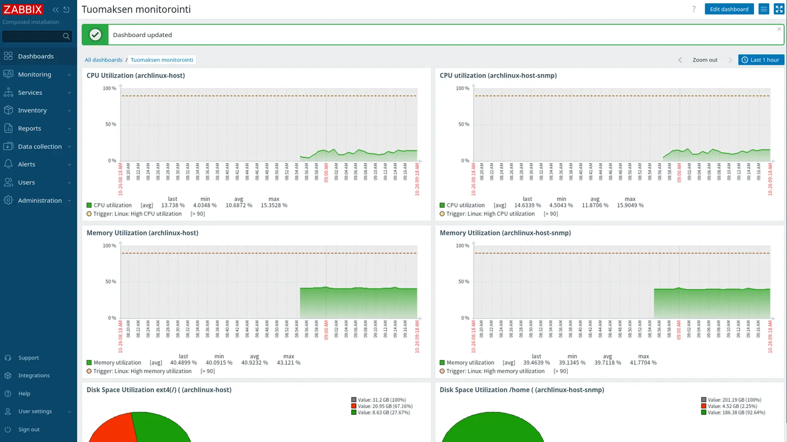
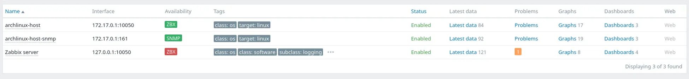

# 📊 Network Monitoring Stack: Zabbix & SNMP Integration

This is a homelab project where I deployed and configured a complete network monitoring stack. It features a containerized **Zabbix** environment monitoring a Linux host through both **Zabbix Agent 2** and secure **SNMPv3** protocols.

## What I Built

* **Hybrid Monitoring Strategy**: Implemented concurrent monitoring for both Zabbix Agent and SNMP targets on an Arch Linux host.
* **SNMPv3 Security**: Configured secure SNMPv3 users utilizing **SHA** for authentication and **AES** for encryption, ensuring modern security standards.
* **Containerized Infrastructure**: Deployed the Zabbix stack (Server, Web UI, MySQL DB) using **Docker Compose** with an Alpine Linux-based image.
* **Service Management**: Diagnosed and resolved port-binding conflicts between the Docker stack and a pre-existing Apache server by managing services via `systemctl`.

---

## Deployment

The monitoring environment was deployed on an Arch Linux workstation using the official Zabbix Docker images:

```bash
docker compose -f ./docker-compose_v3_alpine_mysql_latest.yaml up -d
```
After deployment, an administrative user was created to manage the Zabbix installation and security settings.

---

## Monitoring Configuration

### SNMP (Simple Network Management Protocol)
The host operates as an SNMP agent using a custom-hardened `snmpd.conf`:
* **Security**: Configured SNMPv3 with SHA/AES encryption for secure data retrieval.
* **Access Control**: Defined restricted system views, including `SystemView`, `AllView`, and `LinuxView`.
* **Verification**: Validated connectivity through CLI OID queries for CPU load and disk space.

### Zabbix Agent 2
A local Zabbix Agent 2 was installed and enabled to provide system-level checks:
* **Connectivity**: Defined `Server`, `ServerActive`, and `Hostname` parameters to facilitate communication with the Zabbix container.
* **Templates**: Applied `Linux by Zabbix agent` and `Linux by SNMP` templates to the monitoring targets.

---

## 📈 Results & Visualization

Custom dashboards were created to provide real-time visualization of critical system metrics. 


*Figure 1: Dashboard showing real-time monitoring data.*

* **Performance Tracking**: Widgets display real-time CPU usage, memory utilization, and network traffic.
* **Resource Capacity**: Visual tracking of disk storage levels.
* **Comparative Layout**: The dashboard is organized into two parallel rows, displaying Zabbix Agent data on the left and SNMP data on the right for easy comparison.
* **System Verification**: Active data flow is confirmed via the "Latest data" section.
* **Availability Status**: Successful connectivity is verified by the green availability status for both the Zabbix Agent and SNMP-based hosts.


*Figure 2: Green availability status indicators for both Agent and SNMP interfaces.*

---
*Note: This project was built as part of my System Administration and Infrastructure Monitoring studies. All sensitive credentials have been anonymized for public sharing.*
